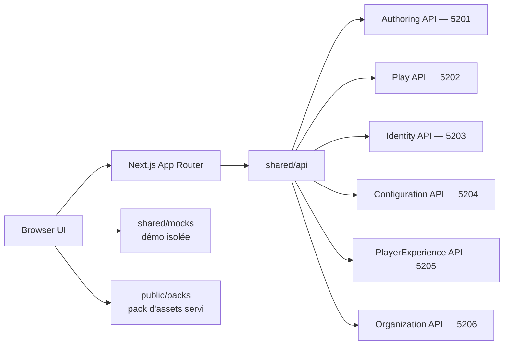

# Architecture

## Décision

GenEngine Web est un client Next.js autonome. Les composants navigateur présentent les projections calculées par GenEngine. Les route handlers serveur forment une façade technique pour les cookies et appels HTTP ; ils ne constituent pas un service métier et n'embarquent pas le moteur narratif.

## Frontières

- `src/app` possède les routes, handlers serveur et la composition.
- `src/features` porte les capacités utilisateur verticales : `home`, `identity`, `settings`, `library`, `player`, `experience`, `studio`, `administration`.
- `src/entities` contient les types et représentations côté client, y compris ceux qui sont **locaux à la démonstration** et n'ont pas d'équivalent serveur.
- `src/shared/api` possède les échanges réseau et adaptations de contrats.
- `src/shared/assets` possède le contrat de pack d'assets et **l'unique point de résolution** d'une référence `packId:assetId` (`resolveAssetReference`), utilisé aussi bien par les aperçus du Studio que par le runtime (`useInstanceMedia`). Un aperçu d'auteur et le rendu d'un joueur ne peuvent donc pas diverger.
- `src/shared/audio` porte le contrat sonore, la résolution des signaux et le fournisseur React. C'est un bloc technique : il ne décide d'aucune règle de jeu et reste neutre lorsqu'un signal n'est pas lié.
- `src/shared/mocks` possède exclusivement les fixtures hors ligne.
- `src/shared/lib` contient les utilitaires sans dépendance UI.
- `src/shared/ui` contient les composants transverses sans logique métier, dont
  le **système unifié de confirmation et de retour** (`feedback-provider`) et le
  **modèle de navigation** (`navigation-model`), qui décide seul quelles routes
  portent l'en-tête global.

Une feature ne dépend pas directement d'une autre. Les règles narratives, validations d'histoires et calculs de transition appartiennent au backend.

## Entrée et navigation

L'atterrissage `/` est le **seuil de connexion** ; la présentation commerciale
vit sur `/plateforme` et reste atteignable depuis le menu et depuis la marque.
`/account` est une redirection permanente vers `/`.

Un seul système de navigation est visible à la fois. `navigation-model`
déclare les routes qui portent la leur — `/experience`, `/play`, `/studio`,
`/administration` — et l'en-tête global ne s'y monte pas. Le masquage est
décidé par le composant, pas par une règle CSS `:has()` : la précédente ne
couvrait pas l'état de chargement de `/experience`, où l'en-tête restait
visible par-dessus le rail de l'univers. Les barres latérales du Studio et de
l'Administration restent — c'est une navigation *intra-section* légitime — et
accueillent désormais les liens globaux via `SectionNav`.

## Résolution des URLs de services

Les six URLs sont résolues **côté serveur**, à chaque requête, par
`resolveServiceUrl()`. La valeur par défaut vient de l'environnement ; une
surcharge propre au navigateur peut la remplacer, transportée par un cookie
`HttpOnly` `SameSite=Strict` que `/parametres` écrit via
`/api/settings/endpoints`. Le navigateur ne lit jamais cette valeur et aucune
variable `NEXT_PUBLIC_` n'est créée : l'invariant 9 tient.

Deux barrières encadrent la capacité. `GENENGINE_ENDPOINT_ALLOWED_HOSTS` borne
les hôtes visables — défaut `localhost`, `127.0.0.1`, `::1`,
`host.docker.internal` — et s'applique à l'écriture, à la sonde et à la
relecture du cookie ; sans elle, le serveur devient un relais vers son propre
réseau interne (CWE-918). Aucun joker n'existe, et l'URL appelée est recomposée
à partir de l'hôte déclaré et d'un port entier borné : une chaîne venant du
cookie n'atteint jamais `fetch`. `GENENGINE_ALLOW_ENDPOINT_OVERRIDE` gouverne la
capacité — activée hors
production, désactivée en production. Désactivée, l'écran reste consultable en
lecture seule et l'enregistrement répond `403`.

`src/shared/api/service-endpoints.ts` est le seul endroit qui connaît les six
services, leurs ports de convention et la validation d'une URL. `/api/catalog`
dupliquait cette résolution et échappait donc à toute surcharge ; il passe
maintenant par la façade.

## Coque immersive

L'application occupe le viewport : `body` mesure `100dvh` et ne défile pas, `main`
porte le défilement, et toute navigation est une surcouche HUD posée sur la scène.
Il n'existe pas de bandeau de page ; l'en-tête est une pastille flottante qui
devient une barre basse sous 900 px, la scène passant alors en premier.

L'échelle `z` est documentée en commentaire dans `globals.css` sur neuf niveaux —
décor `-1`, contenu `1`, HUD `30`, rail `32`, surcouche `40`, plein écran `90`,
dialogue `180`, introduction `200`, lien d'évitement `1000`. **Quatre seulement
sont déclarés en variables** : `--z-hud`, `--z-overlay`, `--z-fullscreen` et
`--z-dialog`. Les autres restent des valeurs littérales dans les feuilles. Noter
que le niveau 40 s'appelle `--z-overlay`, pas `--z-panel`.

## Palette

Les cinq teintes de référence sont déclarées dans `globals.css` : encre
`#17344a`, ivoire `#fffaf0`, sauge `#7a9a55`, or `#d7a746`, azur `#2f7fa0`. Les
alias historiques en dérivent — `--ivory` → `--ivoire`, `--ember` → `--or`,
`--verdigris` → `--azur` (l'azur, donc le bleu, malgré le nom).

Ce sont des teintes de **référence**, pas la palette complète : le fond réel du
runtime est `--ink-950: #060f17`. Elles renvoient aux specs de direction
artistique du dépôt `GenEngine` ; aucune constante `ART_DIRECTION` n'existe dans
ce dépôt.

## Sécurité

Les URLs de services restent côté serveur, sans préfixe `NEXT_PUBLIC_`. Identity fournit le JWT conservé dans le cookie `HttpOnly` `genengine_access`. Les permissions sont appliquées par le service propriétaire ; l'interface peut adapter sa présentation mais ne devient jamais la frontière d'autorisation. `isAuthenticated()` ne teste que la présence du cookie : c'est un signal de présentation, pas un contrôle d'accès.

## Déploiement

Next.js produit une sortie `standalone` dans une image multi-stage. Le runtime s'exécute sans privilèges, avec un filesystem en lecture seule et des espaces temporaires bornés. Compose expose le client sur `3001` pour cohabiter avec Grafana sur `3000`. Le contenu de `public/`, dont le pack d'assets, est copié dans l'image et servi par le runtime standalone.
