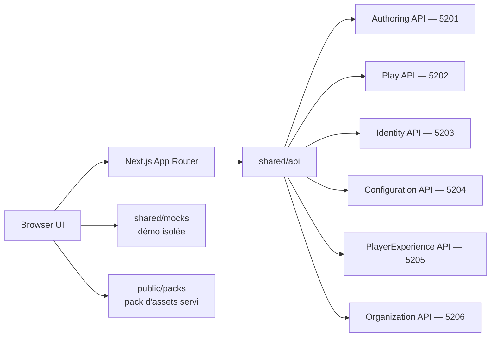

# Architecture

## Décision

GenEngine Web est un client Next.js autonome. Les composants navigateur présentent les projections calculées par GenEngine. Les route handlers serveur forment une façade technique pour les cookies et appels HTTP ; ils ne constituent pas un service métier et n'embarquent pas le moteur narratif.

## Frontières

- `src/app` possède les routes, handlers serveur et la composition.
- `src/features` porte les capacités utilisateur verticales : `home`, `identity`, `library`, `player`, `experience`, `studio`, `administration`.
- `src/entities` contient les types et représentations côté client, y compris ceux qui sont **locaux à la démonstration** et n'ont pas d'équivalent serveur.
- `src/shared/api` possède les échanges réseau et adaptations de contrats.
- `src/shared/assets` possède le contrat de pack d'assets et **l'unique point de résolution** d'une référence `packId:assetId` (`resolveAssetReference`), utilisé aussi bien par les aperçus du Studio que par le runtime (`useInstanceMedia`). Un aperçu d'auteur et le rendu d'un joueur ne peuvent donc pas diverger.
- `src/shared/audio` porte le contrat sonore, la résolution des signaux et le fournisseur React. C'est un bloc technique : il ne décide d'aucune règle de jeu et reste neutre lorsqu'un signal n'est pas lié.
- `src/shared/mocks` possède exclusivement les fixtures hors ligne.
- `src/shared/lib` contient les utilitaires sans dépendance UI.
- `src/shared/ui` contient les composants transverses sans logique métier.

Une feature ne dépend pas directement d'une autre. Les règles narratives, validations d'histoires et calculs de transition appartiennent au backend.

## Coque immersive

L'application occupe le viewport : `body` mesure `100dvh` et ne défile pas, `main`
porte le défilement, et toute navigation est une surcouche HUD posée sur la scène.
Il n'existe pas de bandeau de page ; l'en-tête est une pastille flottante qui
devient une barre basse sous 900 px, la scène passant alors en premier.

L'échelle `z` est documentée en commentaire dans `globals.css` sur neuf niveaux —
décor `-1`, contenu `1`, HUD `30`, rail `32`, surcouche `40`, plein écran `90`,
dialogue `180`, introduction `200`, lien d'évitement `1000`. **Quatre seulement
sont déclarés en variables** : `--z-hud`, `--z-overlay`, `--z-fullscreen` et
`--z-dialog`. Les autres restent des valeurs littérales dans les feuilles. Noter
que le niveau 40 s'appelle `--z-overlay`, pas `--z-panel`.

## Palette

Les cinq teintes de référence sont déclarées dans `globals.css` : encre
`#17344a`, ivoire `#fffaf0`, sauge `#7a9a55`, or `#d7a746`, azur `#2f7fa0`. Les
alias historiques en dérivent — `--ivory` → `--ivoire`, `--ember` → `--or`,
`--verdigris` → `--azur` (l'azur, donc le bleu, malgré le nom).

Ce sont des teintes de **référence**, pas la palette complète : le fond réel du
runtime est `--ink-950: #060f17`. Elles renvoient aux specs de direction
artistique du dépôt `GenEngine` ; aucune constante `ART_DIRECTION` n'existe dans
ce dépôt.

## Pagination du catalogue

Le backend expose une convention unique sur ses listes volumineuses : `page`
(base 1), `pageSize` (défaut 25, borné à `[1, 100]`), `query`, et l'enveloppe
`{ items, page, pageSize, total }`. `offset` et `limit` n'existent plus.

`src/shared/api/pagination.ts` est **le seul endroit** qui connaît ces bornes et
décode l'enveloppe. Un tableau nu y échoue explicitement : l'ancienne forme du
contrat ne doit pas être réinterprétée en catalogue vide (invariant 14).

`src/shared/api/catalog-browser.ts` est le seul point d'accès navigateur à
`/api/catalog`. Les écrans choisissent une stratégie, jamais une URL :

- une page à la fois plus chargement progressif, avec recherche serveur, pour la
  bibliothèque ;
- le catalogue entier, assemblé côté serveur, pour la carte des passages, qui
  doit classer chaque récit par catégorie avant de dessiner une porte ;
- une résolution par identifiants de version pour les écrans qui n'ont besoin que
  d'un titre.

Cette dernière résolution parcourt les pages côté serveur. C'est un
contournement : le backend n'expose pas de lecture unitaire du catalogue. Il
disparaîtra le jour où `GET /catalog/{versionId}` existera.

La règle de rattachement d'un scénario à une catégorie vit dans
`src/entities/story/model/story-category.ts`, et non dans une feature : la carte
et la bibliothèque doivent compter de la même façon.

## Sécurité

Les URLs de services restent côté serveur, sans préfixe `NEXT_PUBLIC_`. Identity fournit le JWT conservé dans le cookie `HttpOnly` `genengine_access`. Les permissions sont appliquées par le service propriétaire ; l'interface peut adapter sa présentation mais ne devient jamais la frontière d'autorisation. `isAuthenticated()` ne teste que la présence du cookie : c'est un signal de présentation, pas un contrôle d'accès.

## Déploiement

Next.js produit une sortie `standalone` dans une image multi-stage. Le runtime s'exécute sans privilèges, avec un filesystem en lecture seule et des espaces temporaires bornés. Compose expose le client sur `3001` pour cohabiter avec Grafana sur `3000`. Le contenu de `public/`, dont le pack d'assets, est copié dans l'image et servi par le runtime standalone.
