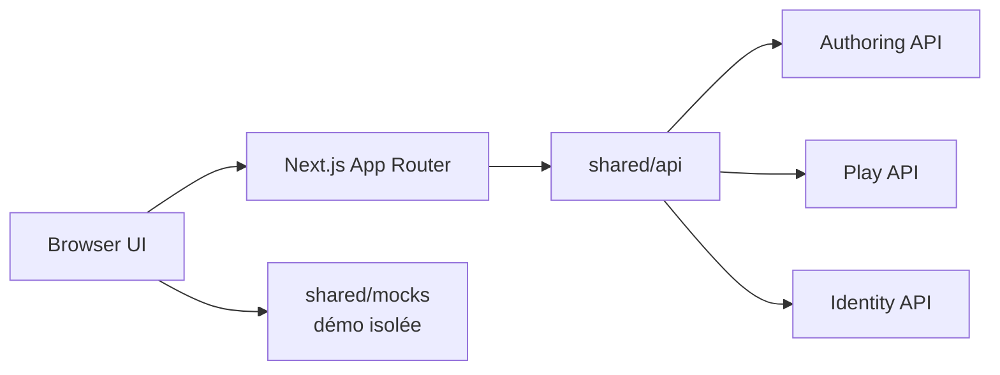

# Architecture

## Décision

GenEngine Web est un client Next.js autonome. Les composants navigateur présentent les projections calculées par GenEngine. Les route handlers serveur forment une façade technique pour les cookies et appels HTTP ; ils ne constituent pas un service métier et n’embarquent pas le moteur narratif.

## Frontières

- `src/app` possède les routes, handlers et la composition.
- `src/features` porte les capacités utilisateur verticales.
- `src/entities` contient les types et représentations côté client.
- `src/shared/api` possède les échanges réseau et adaptations de contrats.
- `src/shared/mocks` possède exclusivement les fixtures hors ligne.
- `src/shared/ui` contient les composants transverses sans logique métier.

Une feature ne dépend pas directement d’une autre. Les règles narratives, validations d’histoires et calculs de transition appartiennent au backend.

## Sécurité

Les URLs de services restent côté serveur. Identity fournit le JWT conservé dans un cookie `HttpOnly`. Les permissions sont appliquées par le service propriétaire ; l’interface peut adapter sa présentation mais ne devient jamais la frontière d’autorisation.

## Déploiement

Next.js produit une sortie `standalone` dans une image multi-stage. Le runtime s’exécute sans privilèges, avec un filesystem en lecture seule et des espaces temporaires bornés. Compose expose le client sur `3001` pour cohabiter avec Grafana sur `3000`.
